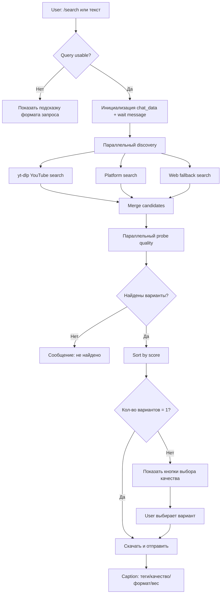
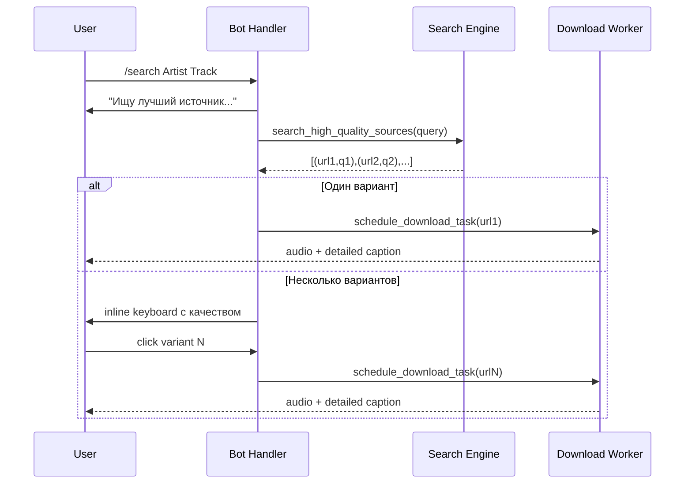
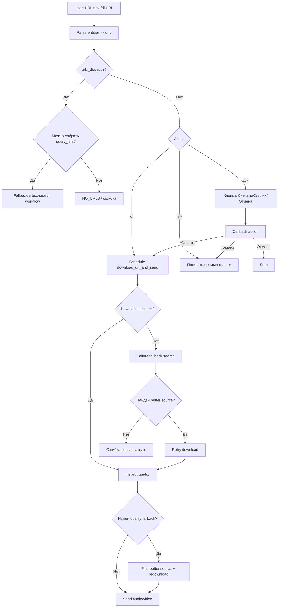

# Search Workflow (Text Query / Link)

Ниже — детальный workflow текущего `scdlbot` для двух основных сценариев:

1. поиск по тексту (`исполнитель - трек` / `/search ...`)
2. поиск по ссылке (`/dl <url>` или просто сообщение со ссылкой)

---

## 1) Текстовый поиск: `исполнитель - название трека`

### High-level шаги

1. Пользователь отправляет `/search ...` или обычный текст.
2. Бот валидирует запрос (`is_usable_query`), инициализирует chat settings.
3. Запускается параллельный discovery:
   - `discover_youtube_candidates(...)` через `yt-dlp` (`ytsearch*`)
   - `discover_platform_candidates(...)` (YouTube+остальные платформы)
   - `discover_web_candidates(...)` (если включён web fallback)
4. Для кандидатов запускается параллельный quality probe (`probe_remote_quality`).
5. Ранжирование: релевантность названия + качество аудио + приоритет YouTube HD.
6. Если один вариант — сразу скачивание.
7. Если несколько вариантов — бот показывает кнопки выбора качества.
8. После выбора кнопки — стартует скачивание выбранного URL.
9. Отправка трека с детальным caption (теги/качество/формат/вес).

### Flowchart

### Sequence

---

## 2) Поиск по ссылке: `/dl <url>` или сообщение со ссылкой

### High-level шаги

1. Бот парсит URL из message entities.
2. Проверяет домен и доступность (`url_valid_and_allowed` / whitelist/blacklist).
3. Формирует `urls_dict` и выбирает действие по mode:
   - `dl`: скачать
   - `link`: показать прямые ссылки
   - `ask`: показать inline-кнопки (скачать/ссылки/отмена)
4. В `dl` режиме:
   - для каждого URL запускает `download_url_and_send` в worker pool
   - при fail запускает fallback (query hint -> cross-platform search)
5. Внутри `download_url_and_send`:
   - source-specific strategy (scdl/bandcamp-dl/yt-dlp)
   - quality fallback к лучшему источнику при необходимости
6. Финальная отправка файла в Telegram с детальным caption.

### Flowchart

---

## 3) Состояния и точки конфликтов (concurrency audit checklist)

### Ключевые state keys в `chat_data`

- `settings` — режим (`dl/link/ask`), `flood`, `allow_unknown_sites`
- `search_choice:<token>` — временное состояние выбора качества
- `<message_id>` — временное состояние ask-mode для URL-кнопок

### Потенциальные конфликтные зоны

1. **Просроченные callback-кнопки**
   - кнопка нажата после очистки `chat_data` ключа.
   - текущая обработка: возврат `OLD_MSG_TEXT`.

2. **Параллельные запросы одного пользователя**
   - несколько одновременных `search_choice:*` ключей.
   - mitigation: token-based isolation, pop-on-use.

3. **Долгий probe/download**
   - download выполняется в executor (`ThreadPool`/`ProcessPool`), чтобы не блокировать event loop.

4. **Нестабильные внешние источники**
   - fallback chains: platform search -> web fallback -> quality fallback retry.

### Operational рекомендации

- Держать `EXECUTOR_KIND=thread` в cloud, если нет нужды в process serialization.
- Для высоких нагрузок ограничивать `FALLBACK_MAX_CANDIDATES`.
- Включать web fallback только при необходимости (`ENABLE_WEB_FALLBACK=1/0`).
- Мониторить латентность callback и размер очереди executor.
